# 纵览轻量化卷积神经网络:SqueezeNet,MobileNet,ShuffleNet,Xception
[web](https://www.jiqizhixin.com/articles/2018-01-08-6)

由于这四种轻量化模型仅是在卷积方式上做了改变,因此本文仅对轻量化模型的创新点进行详细描述,对实验以及实现的细节感兴趣的朋友,请到论文中详细阅读.

## SqueezeNet
SqueezeNet由伯克利&斯坦福的研究人员合作发表于ICLR-2017.本文的新意是squeeze,squeeze在SqueezeNet中表示一个squeeze层,该层采用`1x1`卷积核对上一层`feature map`进行卷积,主要目的是减少`feature map`的维数(通道数).

创新点:

- 采用不同于传统的卷积方式,提出`fire module`:`squeeze层+expand层`

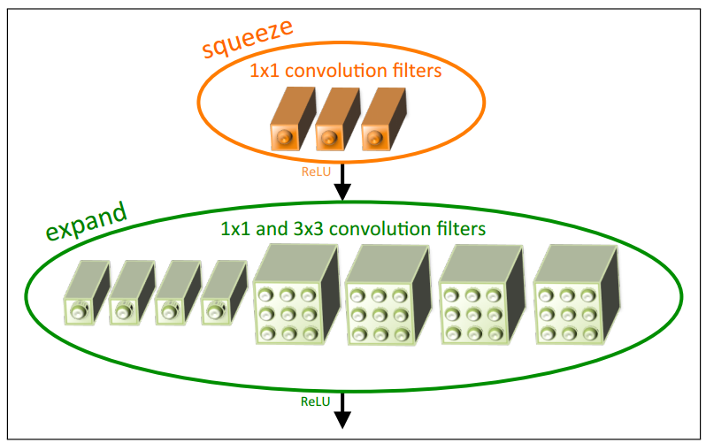

创新点与inception系列的思想非常接近!首先squeeze层,就是`1x1`卷积,其卷积核数要少于上一层`feature map`数,这个操作从inception系列开始就有了,并美其名压缩.Expand层分别用`1x1`和`3x3`卷积,然后concat,这个操作在inception系列里面也有.

SqueezeNet的网络结构,如下图所示:

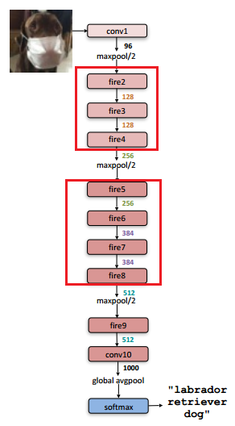

网络结构设计思想,同样与VGG的类似,堆叠的使用卷积操作,只不过这里堆叠的使用本文提出的Fire module(图中用红框部分).

SquezeeNet的参数数量以及性能:

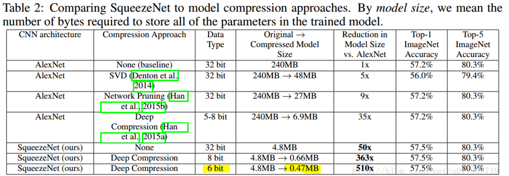

## MobileNet
MobileNet由Google团队提出,发表于CVPR-2017.MobileNet的命名是从它的应用场景考虑的,顾名思义就是能够在移动端使用的网络模型.

创新点:

- 采用名为depth-wise separable convolution的卷积方式代替传统卷积方式,以达到减少网络权值参数的目的

depth-wise convolution不是MobileNet提出来的,也是借鉴.depth-wise convolution和group convolution是类似的,depth-wise convolution是一个卷积核负责一部分feature map,每个feature map只被一个卷积核卷积;group convolution是一组卷积核负责一组feature map,每组feature map只被一组卷积核卷积.Depth-wise convolution可以看成是特殊的group convolution,即每一个通道是一组.

MobileNets精华在于卷积方式,depth-wise separable convolution;采用depth-wise separable convolution,会涉及两个超参:Width Multiplier和Resolution Multiplier,这两个超参只是方便于设置要网络要设计为多小,方便于量化模型大小.

MobileNet将标准卷积分成两步:

1. 第一步,Depth-wise convolution,即逐通道的卷积,一个卷积核负责一个通道,一个通道只被一个卷积核滤波
2. 第二步,Pointwise convolution,将depth-wise convolution得到的feature map再串起来

从另外一个角度考虑,其实就是:输出的每一个feature map要包含输入层所有feature map的信息.然而仅采用depth-wise convolution,没办法做到这点,因此需要pointwise convolution的辅助.

输出的每一个feature map要包含输入层所有feature map的信息,这个是所有采用depth-wise convolution操作的网络都要去解决的问题,ShuffleNet中的命名就和这个有关!

Standard convolution,depth-wise convolution和pointwise convolution示意图如下:

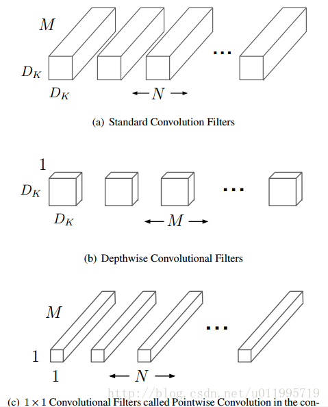

其中输入的feature map有M个,输出的feature map有N个.

对Standard convolution而言,是采用N个大小为`DK*DK`的卷积核进行操作,卷积核大小是`DK*DK`,`DK*DK*M`是具体运算时一个卷积核的大小.

而depth-wise convolution + pointwise convolution需要的卷积核呢?

Depth-wise convolution:一个卷积核负责一个通道,一个通道只被一个卷积核卷积,则这里有M个`DK*DK`的卷积核.

Pointwise convolution:为了达到输出N个feature map的操作,所以采用N个`1x1`的卷积核进行卷积,这里的卷积方式和传统的卷积方式是一样的,只不过采用了`1x1`的卷积核,其目的就是让新的每一个feature map包含有上一层各个feature map的信息.在此理解为将depth-wise convolution的输出进行串起来.

MobileNet共28层,可以发现这里下采样的方式没有采用池化层,而是利用depth-wise convolution的时候将步长设置为2,达到下采样的目的.

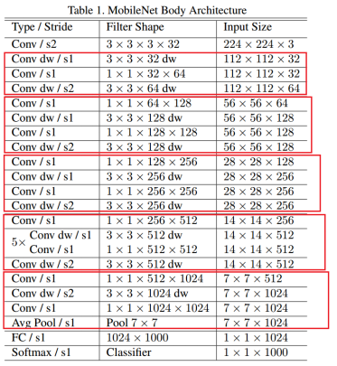

MobileNet-224与GoogLeNet及VGG-16的对比:

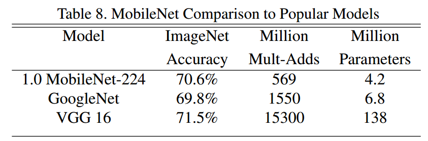

可以发现,相较于GoogLeNet,虽然参数差不多,都是一个量级的,但是在运算量上却小于GoogLeNet一个量级,这就得益于depth-wise convolution.

## ShuffleNet
ShuffleNet是Face++团队提出的,发表于CVPR-2017,但晚于MobileNet两个月才在arXiv上公开.

shuffle具体来说是channel shuffle,是将各部分的feature map的channel进行有序的打乱,构成新的feature map,以解决group convolution带来的信息流通不畅问题.(MobileNet是用point-wise convolution解决的这个问题)

因此可知道shuffle不是什么网络都需要用的,是有一个前提,就是采用了group convolution,才有可能需要shuffle.为什么说是有可能呢?因为可以用point-wise convolution来解决这个问题.

对比一下MobileNet,采用shuffle替换掉`1x1`卷积,这样可以减少权值参数,而且是减少大量权值参数,因为在MobileNet中,`1x1`卷积层有较多的卷积核,并且计算量巨大.

ShuffleNet的创新点在于利用了group convolution和channel shuffle,那么有必要看看group convolution和channel shuffle.

### Group convolution
Group convolution自Alexnet就有,当时因为硬件限制而采用分组卷积.之后在2016年的ResNeXt中,表明采用group convolution可获得高效的网络.再有Xception和MobileNet均采用depth-wise convolution,这些都是最近出来的一系列轻量化网络模型.depth-wise convolution具体操作可见MobileNet部分.

## Xception
Xception并不是真正意义上的轻量化模型,只是其借鉴depth-wise convolution,而depth-wise convolution又是上述几个轻量化模型的关键点,所以在此一并介绍,其思想非常值得借鉴.

Xception是Google提出的,arXiv的V1版本于2016年10月公开.Xception是基于Inception-V3的,而X表示Extreme,为什么是Extreme呢?因为Xception做了一个加强的假设:

>卷积神经网络特征映射中的交叉通道相关性和空间相关性可以完全解耦.

Inception module:

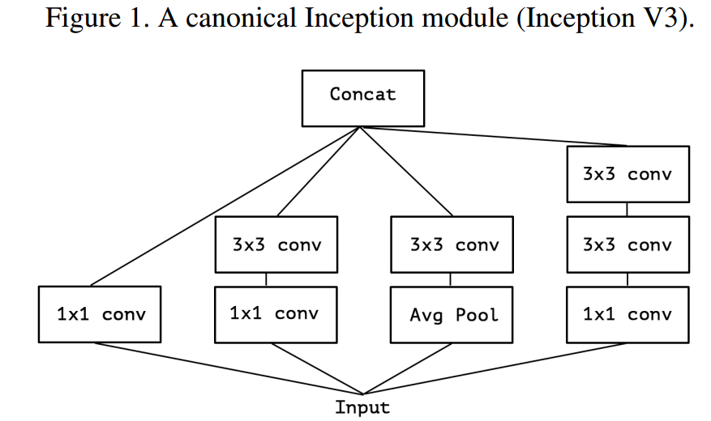

Simplified Inception module:

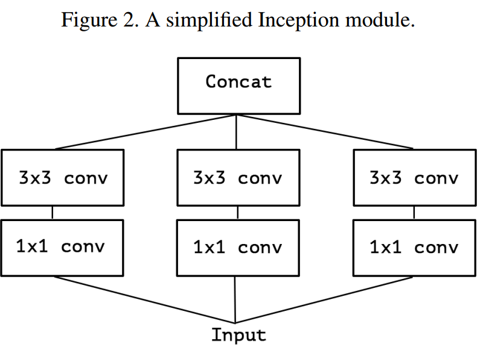

在简化版Inception module之后,进一步把第一部分的3个`1x1`卷积核统一起来,变成一个`1x1`的,后面的3个`3x3`的分别负责一部分通道:

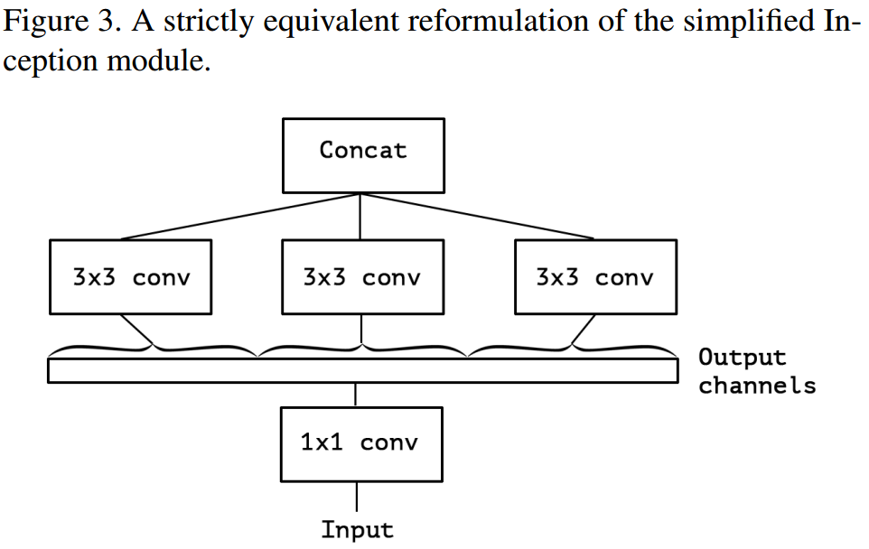

最后提出extreme version of an Inception,module Xception,先用`1x1`卷积核对各通道之间(cross-channel)进行卷积:

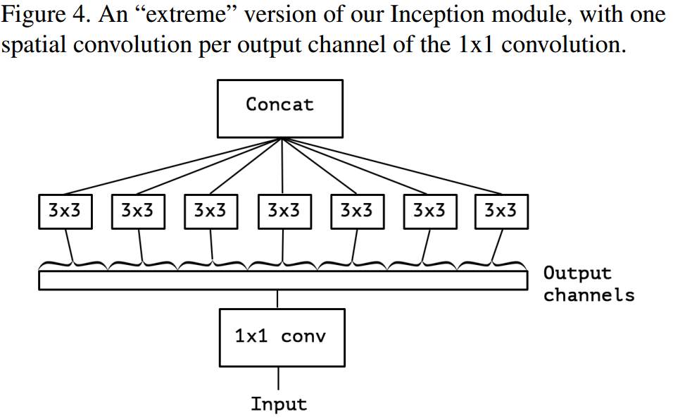

Xception实验:

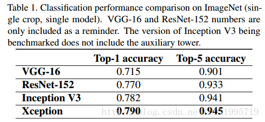

## Notes
实现轻量化技巧:

- SqueezeNet,`1x1`卷积核压缩feature map数量
- MobileNet,Depth-wise convolution
- ShuffleNet,Depth-wise convolution
- Xception,改进Depth-wise convolution