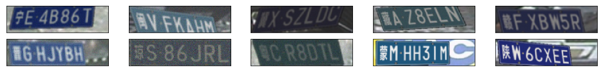

车牌生成器,参考[szad670401](https://github.com/szad670401/end-to-end-for-chinese-plate-recognition)实现,对代码进行了精简,支持py3.依赖项:

```
pip install pillow opencv numpy
```

建议编译安装OpenCV3.2,包含扩展部分.

运行示例:
```
import sys
sys.path.append('/data2/gits')
from pyhej.genplate import genplate
G = genplate.GenPlate()
res = G.gen_batch(10, './temp')

from pyhej.image_view import get_plt_show
get_plt_show(['./temp/%03d.jpg' % i for i in range(10)], height=0.3).show();
```


